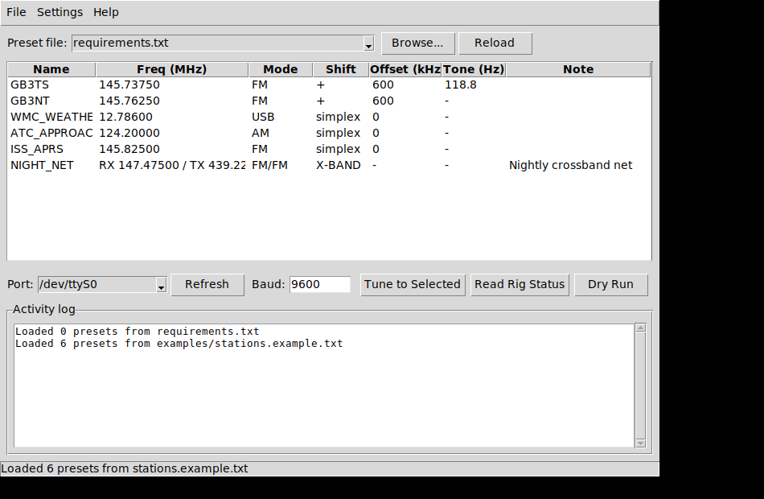

# FT-847 Quick Tune

A free, open-source CAT control tool for the Yaesu FT-847 that programs
frequency, mode, repeater shift, and CTCSS tone from a preset list —
without burning one of the rig's limited internal memory channels.

Comes with both a **command-line tool** and a **desktop GUI**, and can
load presets straight from a [RepeaterBook.com](https://repeaterbook.com)
CSV export or a simple text file.



## Why this exists

The FT-847 shipped with a great piece of third-party software called
**FT847-SuperControl**, but its registration server has gone offline and
the retailers who used to sell licenses have stopped supporting it. This
project reimplements the CAT features most people actually need — quick
tuning to non-memory stations like weatherfax, ATC frequencies, and
one-off repeaters — as a free replacement, built directly against the
FT-847's real CAT protocol (reverse-engineered and confirmed against
actual hardware; see [Protocol notes](#protocol-notes-ft-847-cat-quirks)
below).

## Features

- Tune frequency, mode, repeater shift, and CTCSS tone in one action
- Load presets from a plain-text `stations.txt` **or** a RepeaterBook.com
  CSV export directly — no conversion step needed
- GUI or CLI, sharing the same tested core logic
- Auto-detects serial ports
- Read-back verification: confirms what the rig actually landed on
- All serial settings (baud, RTS/DTR, etc.) configurable via `ft847.ini`

## Installation

```bash
git clone https://github.com/YOUR_USERNAME/ft847-tune.git
cd ft847-tune
pip install -r requirements.txt
```

The GUI uses Tkinter, which ships with most Python installations
(including python.org's Windows installer). If you get a "No module
named tkinter" error on Linux, install it via your package manager, e.g.
`sudo apt install python3-tk`.

## Usage

### GUI

```bash
python3 ft847_gui.py
```

Pick a preset file (or use **File > Open...**), select a preset from the
list, choose your serial port, and click **Tune to Selected**. Double-
clicking a row in the table also tunes to it. **Read Rig Status** queries
the rig's current frequency/mode without changing anything. **Settings >
Serial settings...** lets you configure and save baud rate, RTS/DTR, and
so on to `ft847.ini`.

### Command line

```bash
# Fully interactive: pick a file, then a preset, then a port
python3 ft847_cli.py

# List presets in a specific file
python3 ft847_cli.py --file examples/6m_Victoria.csv --list

# Scripted / one-shot
python3 ft847_cli.py --file examples/6m_Victoria.csv VK3RDD --port COM3

# Check what the rig currently reports without tuning anything
python3 ft847_cli.py --status

# Preview the CAT frames that would be sent, without opening the port
python3 ft847_cli.py --file examples/6m_Victoria.csv VK3RDD --dry-run
```

## Configuration (`ft847.ini`)

Copy `ft847.ini.example` to `ft847.ini` and edit it, or use the GUI's
**Settings > Serial settings...** dialog (which writes the same file).
`ft847.ini` is gitignored so your personal port/baud settings won't get
committed if you fork or contribute back.

**The baud rate must match your rig's CAT RATE menu setting** (FT-847
menu items 15/16) — this is the single most common cause of "nothing
happens" when first setting this up.

## Preset file formats

### `stations.txt` style

```
name, frequency_hz, mode, shift, offset_hz, tone_hz [, note]
```

| Field | Meaning |
|---|---|
| `name` | Identifier (spaces are fine; used as-is in the GUI table and CLI selection) |
| `frequency_hz` | Receive/simplex frequency in Hz |
| `mode` | `LSB` `USB` `CW` `CWR` `AM` `FM` `AMN` `FMN` `CWN` `CWNR` |
| `shift` | `+`, `-`, or `S` (simplex) |
| `offset_hz` | Repeater shift amount in Hz (informational — see note below) |
| `tone_hz` | CTCSS tone, e.g. `88.5`, or `NONE` |
| `note` | Optional free-text note, shown in both the GUI table and CLI listing |

If the same name appears more than once (e.g. the same station listed
twice for different time windows), later entries get `_2`, `_3`, etc.
appended automatically rather than silently overwriting the earlier one.

Lines starting with `#` are comments; inline `# comment` after a value is
also stripped. See `examples/stations.example.txt`.

#### Crossband nets (Satellite mode)

For nets or repeaters with completely independent TX and RX frequencies
(e.g. RX on 2m, TX on 70cm), use an 8-field line instead, with the second
field literally `CROSSBAND`:

```
name, CROSSBAND, rx_freq_hz, rx_mode, tx_freq_hz, tx_mode, tx_tone_hz, note
```

This drives the FT-847's **Satellite mode** — independent SAT RX and SAT
TX VFOs — since the rig doesn't support true CAT-controlled split on the
Main VFO. It's the same mechanism the rig uses for actual satellite
uplink/downlink, repurposed here for crossband nets. Example:

```
NIGHT_NET, CROSSBAND, 147475000, FM, 439225000, FM, NONE, Nightly crossband net
```

#### Satellite operation

Actual amateur satellite work uses the same Satellite-mode mechanism as
crossband nets — see `examples/stations.example.txt` for working SO-50
and ISS crossband-repeater presets.

Two things to know:

- **SO-50 needs a two-step tone sequence**, not one tone. Key up briefly
  (~2 seconds) with a 74.4 Hz tone to arm its 10-minute on-timer, *then*
  switch to 67.0 Hz for your actual transmissions — the arm tone alone
  won't open the repeater for traffic. This is why the example file has
  two separate SO-50 presets (`SO50_ARM` and `SO50_QSO`) sharing the same
  frequencies but different tones, rather than one.
- **This tool does one-shot static tuning, not continuous Doppler
  tracking.** A satellite's downlink can drift several kHz over a pass. A
  preset gets you correctly configured at the start, but won't follow the
  shift as the pass progresses. For full-pass tracking, pair this with
  dedicated satellite tracking software (e.g. Gpredict driving Hamlib's
  `rigctld`) rather than relying on a static preset for the whole pass.

### RepeaterBook.com CSV export

Search RepeaterBook for your band/area, click **Download Results**, and
point either front-end at the file directly — no conversion needed. The
tool reads `Output Freq`, `Input Freq`, `Uplink Tone`, `Call`, `Location`,
and `Modes` columns to build presets automatically. See
`examples/6m_Victoria.csv` for the expected format.

## Protocol notes (FT-847 CAT quirks)

The FT-847's CAT implementation has several undocumented (or ambiguously
documented) behaviors that this project had to reverse-engineer against
real hardware, cross-checked against Hamlib's driver and — for the
trickiest part — by sniffing FT847-SuperControl's own serial traffic.
Documenting them here in case they help anyone else working with this rig:

1. **CAT lock-on is required first.** The rig ignores every other CAT
   command until it receives a five-byte all-zero frame (opcode `0x00`).
   This isn't mentioned in the manual's quick-reference examples.

2. **CTCSS tone is not a BCD-encoded frequency.** Unlike the main VFO
   frequency, the tone is set via a lookup-table byte (`0x00`-`0x3F`)
   identifying one of 39 standard CTCSS tones, sent as the first data
   byte with opcode `0x0B`.

3. **The CTCSS/DCS mode command and the repeater-shift command both put
   their selector value in the *first* data byte, with a fixed opcode as
   the final byte** — e.g. repeater shift is always opcode `0x09`, with
   `0x09`/`0x49`/`0x89` in the first byte selecting minus/plus/simplex.
   This is the opposite of what a literal reading of the manual's example
   tables suggests, and was the hardest part to get right.

4. **The repeater-offset-*amount* command (opcode `0xF9`) is effectively
   non-functional** on real hardware, confirmed by direct comparison
   against SuperControl's own traffic (which never sends it either). The
   rig instead applies its own internally menu-configured default offset
   for the current band once shift direction is set — the same mechanism
   SuperControl relies on. If shift isn't engaging, check the FT-847's
   **per-band ARS (Automatic Repeater Shift) menu items** (e.g. menu #14
   for 144 MHz) rather than assuming it's a software problem.

5. **Crossband operation uses Satellite mode, not split.** The FT-847 has
   no CAT-controllable split on the Main VFO. Instead, several commands
   (frequency set/read, mode set, CTCSS set/mode) select their target VFO
   by *adding* an offset to a base opcode: `+0x00` for Main, `+0x10` for
   SAT RX, `+0x20` for SAT TX. Turning on Satellite mode (opcode `0x4E`)
   and addressing the SAT RX/TX VFOs independently gives full crossband
   control — RX and TX can even be on completely different bands. This
   VFO-offset scheme, along with the lock-on frame and the read-frequency
   command format, is independently corroborated by
   [Hamlib issue #1286](https://github.com/Hamlib/Hamlib/issues/1286),
   where Hamlib developers debugging the same rig's satellite-mode CAT
   traced identical byte sequences.
6. **A SAT RX/TX VFO may not read back correctly until it's been written
   to at least once in the current CAT session** — reported independently
   in the Hamlib thread above. This tool always writes both VFOs before
   reading them back during a crossband tune, so it isn't affected, but
   it's worth knowing if you query a SAT VFO without ever having set it.

## Known limitations

- Repeater offset *amount* can't be set via CAT — it comes from the rig's
  own menu-configured default per band (see above). This matches
  SuperControl's own behavior, not a limitation unique to this tool.
- Downlink CTCSS tone (decode) isn't applied from RepeaterBook imports if
  it differs from the uplink tone — the FT-847 drives encode and decode
  from a single tone setting.
- **Can't switch the rig between VFO and Memory mode via CAT.** Confirmed
  absent from the protocol — even Hamlib's own FT-847 driver notes
  `"No set_vfo function"` for this rig. Repeater shift/ARS requires VFO
  mode, so if a preset with shift isn't applying, check the front panel
  VFO/MEM button first; the tool prints a reminder about this whenever
  it applies a preset with shift set.
- Tested against one physical FT-847 with the MARS/extended-coverage
  modification. Behavior on unmodified units or different firmware
  revisions should be the same (the CAT protocol itself doesn't change),
  but hasn't been separately confirmed.

## Contributing

Issues and pull requests welcome — especially confirmations (or
corrections) from other FT-847 owners, additional preset-file format
support, or GUI polish.

## License

MIT — see [LICENSE](LICENSE).
